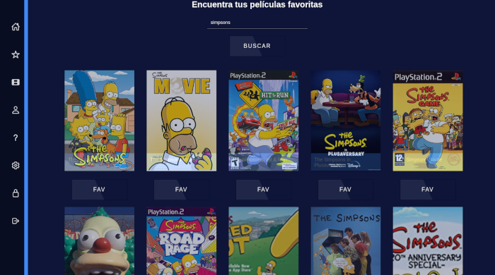

<h1 align="center">TuPeli</h1>

- In this project I learned to consume an endpoint in backend.

<h3 align="left">Languages and Tools:</h3>

- JavaScript, React.JS, Redux and CSS.

- 

<a href="https://redux.js.org" target="_blank" rel="noreferrer"> 

- 👨‍💻 This project is available at [https://leocipollone.github.io/movies/](https://leocipollone.github.io/movies/)
